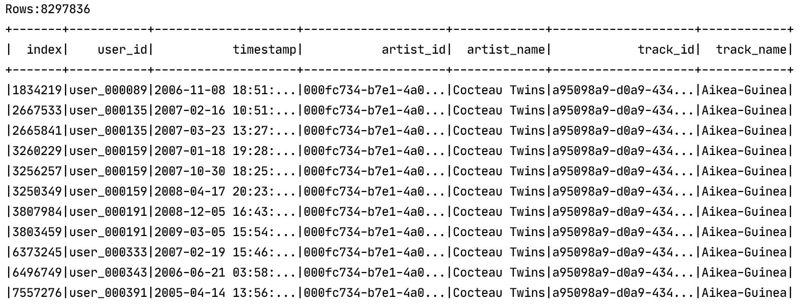
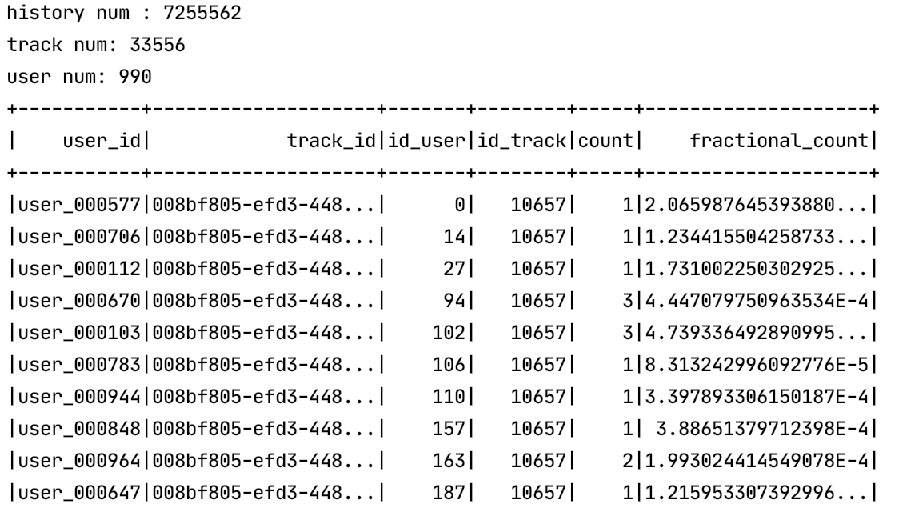
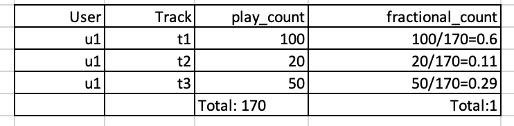
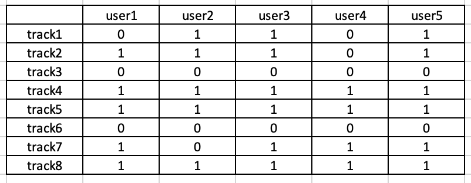
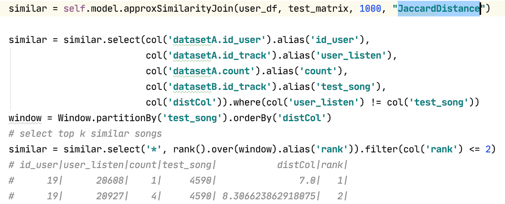
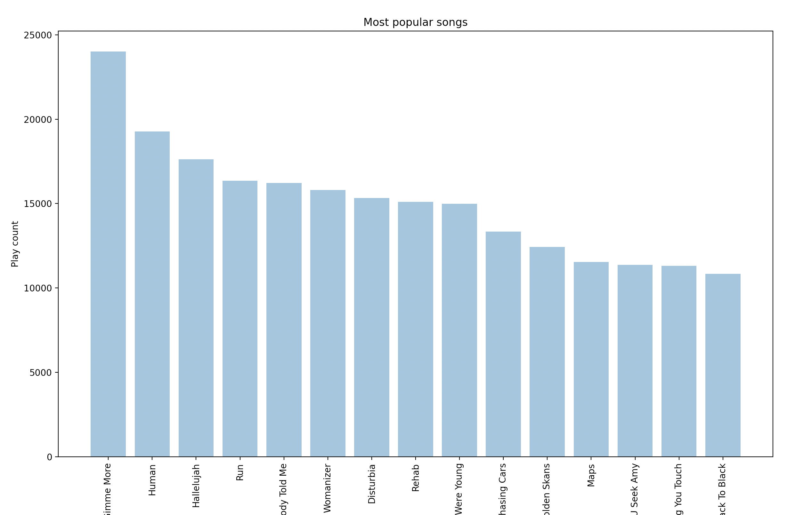
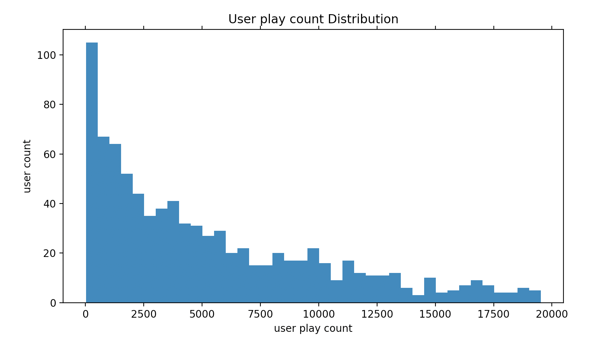
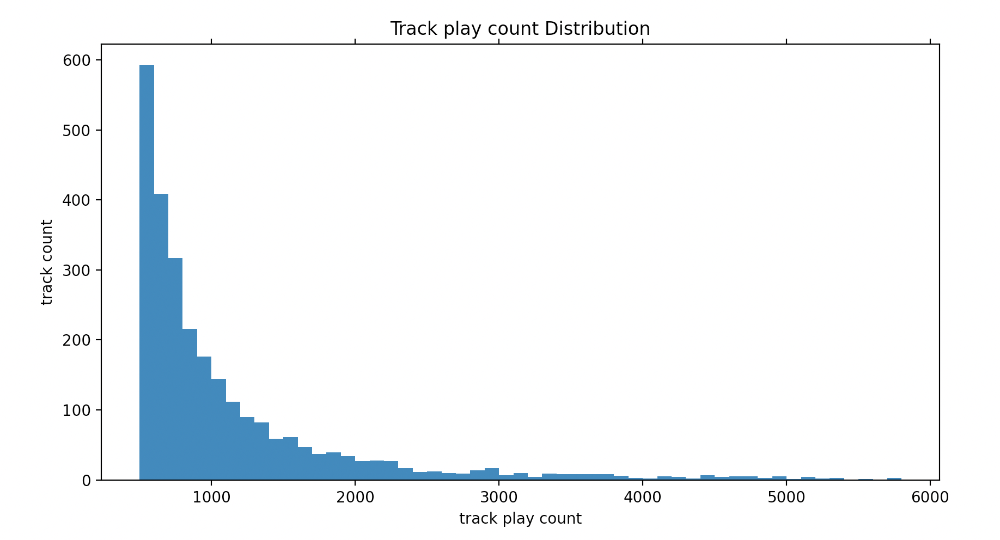
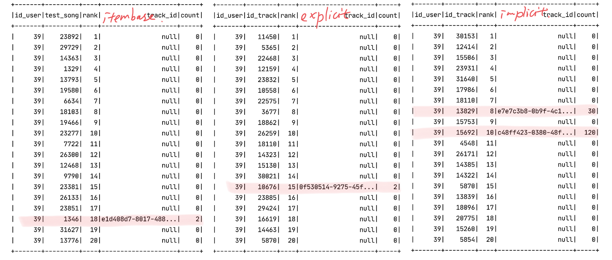
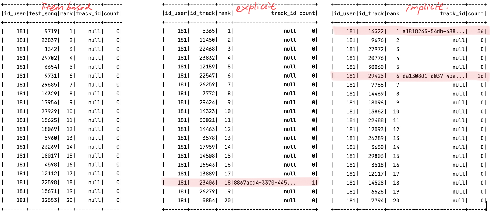

# Don't Stop the Music
## Abstract

In this project, we design and implement a song recommender system. To get the analysis data, we use Last.fm -1K from the Million Song Dataset. Last.fm -1k provides users' listening history along with the user's and track's brief profile collected from Last.fm. We use collaborative filtering, which predicts user preferences in item selection based on the known user ratings of items. Specifically, we adopt KNN item-based model and latent factor model to make the recommendation, respectively, and the result shows that the implicit latent factor model works best. We think the rationale is that the data from Last.fm does not naturally contain the rating data, which exactly is what implicit latent factor helps. 

## Introduction
### Context
The recommender system has many successful applications in the industry. According to statistics, 40% of Amazon's sales are generated by the recommender system; 75% of Netflix users use the recommendation system to find their favorite videos; 30% of Netflix users use keywords to search the products they need before online shopping. Almost all news, search, advertising, short video applications are based on the recommender system nowadays.
### Object
Our study aims to make efficient offline music recommendations for users based on the Last.fm-1K dataset. This dataset contains a thousand users' listening history and users' profiles.
### the Problem to Solve
First, in the original Last.fm dataset, we had more than eight million recordings, but many tracks only appeared once. To make the recommendation more efficient, we want to make sure how many tracks should be used to apply to the training and prediction. For example, how many songs account for 80% of listening records? 

The second problem we are to solve is the 'rating' problem. We don't have an intuitive "rating" in our data; all we have is the play count of various songs. We use a straightforward solution to take the frequency of the track as the rating. The logic is that this will measure the strength of a song's "similarity" in the
Range [0,1].

As a comparision, we will try the other algorithm, namely Matrix factorization-based collaborative filtering, which can directly use user-item interaction matrix as training data.
Matrix factorization can be used to discover latent features between two different kinds of entities\cite{}.Converting our dataframe into a numpy matrix in the format of utility matrix is the problem to be solved. 


### Related Work
Since recommandation system is a quite mature project, there are many related works done by researchers and developers. McFee et al. intrdouced the Million Song Dataset Challenge in 2012[1]. Amazon uses their own algorithm, item-to-item collab-orative filtering, which online computation scales independently of the number of customers andnumber of items in the product catalog [2]. In [3], Elena Shakirova had an investigation of using collaborative filtering techniques for a music recommender system and found the best result for non-trivial α=0.15 and q=3 in the item-based case, α=0.3 and q=5 in the user-based case.


## Materials and Methods

### DataSet

Our datasets come from last.fm. There are two parts of dataset, 

1. The Last.fm dataset in Million Song Dataset [4]

   http://millionsongdataset.com/lastfm/ , which provides songs metadata and song-level tags datasets.

   1) track_metadata.db

   Which contains 100k songs with track_id, title text, song_id , release time, artist_id , artist_mbid, artist_name, duration, artist_familiarit , artist_hotttnesss  year.

   2) lastfm_tags.db

   which provides a list of unique tags and a list of song-tag pairs. There are 50K unique tags and each song can have multiple tags. Now, we can get song-level data, used as item dataset  from the above two database.

2. Last.fm Dataset-1k [5]

   http://ocelma.net/MusicRecommendationDataset/lastfm-1K.html, which provides users' listening history  and  users' brief profile collected from last.fm.  The listening history contains almost 2000k lines with <index, user_id, timestamp, artist_id, artist_name, track_id, track_name> tuple, in which has almost 1k users. The user profile data contains 1k users with <userid, gender, age, country, signup time>.


### Data Analysis

1. #### Data Trimming

   There are 2000k records in the Last.fm dataset, which contains a large number of not useful data. So the first step is to extract useful data, intersection the listening history and songs dataset, thus keepping the history that has responding songs in the songs dataset. After the intersect operation, the listening history dataset is reduced to 800k lines and the songs dataset is reduced to 20k lines.

   After data cleaning and extraction, we got a track metadata file, a play history data file, and a user profile data file. In this project, for now, we just used the play history data to build recommendation systems.
   <div  align = "center">
   
   </div>
   <div align = "center"> Fig.1 The original listening history data </div>

   Since the dataset is too huge to fit our computer, the first step of the data analysis is extracting the play history of the most popular songs. We extract 20% of top popular songs’ history. The next step is aggregating the play count by group by (user id, track id). Then we got a data file as below: (user, track, play_count).
    <div  align = "center">
   
   </div>
   <div align = "center"> Fig.2 Trimmed dataset </div>
   

   The playing history dataset is an "implicit feedback" dataset, which reflects users’ behavior, but not explicitly provides the rating of various songs from users. We adopt a simple solution that is using fractional count as the rating. Fractional count in the range of [0,1], which can measure the strength of “likeness” for a song for a user [6].
   <div  align = "center">
   
   </div>
   <div align = "center"> Fig.3 Fractional count </div>
   
2. #### Data visualization

   Before we starting the algorithm, we can have a look at the dataset distribution. For songs, we can statistic the top k most popular songs, artists, tags, countries and, so on. For users, we can statistic the gender proportions and aged distribution. we can use the MatLab library to visualize those statistic results.
   
   
   
### Recommendation Algorithm

1. #### Item-based recommendation engine

   To implement item-based collaborative filtering, we need two kinds of data, users feature and items feature. Our plan is to extract song features and user features from the song-tag dataset and user listening history. When data is ready, we can build a song-user matrix. 

   We used pyspark to implement the item-based recommendation model. 

   ##### Building a utility matrix

   ```
   rdd = df.rdd.map(lambda x: (x.id_track, [(x.id_user, 1)]))
   rdd = rdd.reduceByKey(lambda a, b: a + b)
   rdd = rdd.map(lambda x: (x[0], SparseVector(1000, x[1])))
   matrix = spark.createDataFrame(rdd, ['id_track', 'features'])
   ```
   <div align = "center">
      
   </div>
   <div align = "center"> Fig.4 Build a matrix </div>

   If user1 has listened to track1 then unit[track1, user1] set as 1, otherwise set as 0. Because the feature rows are long and sparse, so we use the sparse vector for it.

   ##### Computing similarity of songs

   Considering the scale of the dataset and evaluation metric, we used the function approxSimilarityJoin() in the pyspark to compute the similarity of all recommended songs with other songs for all test users in one go.
   <div align = "center">
      
    </div>
   <div align = "center"> Fig.5 Compute the similarity </div>

   ##### Computing the score for recommendation

   For each recommended song, we select k most similar songs to compute the score. The similarity score is calculated as
      


2. #### Matrix factorization-based collaborative filtering

   The users listening history is a user behavior dataset, which doesn't explicitly reflect the taste of users, thus it's called implicit feedback. If we use the statistic method to construct user preferences directly, it will lose some information contained in listening history. For implicit feedback, we use matrix factorization-based collaborative filtering to implement a recommendations system. Apache Spark ML implements ALS for collaborative filtering, a very popular algorithm for making recommendations. ALS recommender is a matrix factorization algorithm that uses Alternating Least Squares with Weighted-Lamda-Regularization (ALS-WR). It factors the user to item matrix A into the user-to-feature matrix U and the item-to-feature matrix M: It runs the ALS algorithm in a parallel fashion. The ALS algorithm should uncover the latent factors that explain the observed user to item ratings and tries to find optimal factor weights to minimize the least squares between predicted and actual ratings. [N1]. 
   ##### Train model
   
   Explicit model 
   
   Setting implicitPrefs =False, ratingCol="fractional_count" (using fractional_count replace explicit rating)
   
    ```
   ALS(maxIter=5, regParam=0.01, userCol="id_user", itemCol="id_track",
   					 ratingCol="fractional_count",
              implicitPrefs=False,
              coldStartStrategy="drop")
   model = als.fit(training)
    ```
   Implicit model 
   
   Setting implicitPrefs =Ture, ratingCol="count"
   
   ```
   ALS(maxIter=5, regParam=0.01, userCol="id_user", itemCol="id_track", ratingCol="count",
             implicitPrefs=True,
             coldStartStrategy="drop")
   ```
   
   
   
3. #### Evaluation

   In our project, we implemented three different recommendation models, the item-based model, ALS(explicit) model, and ALS(implicit) model. Each model computes a score for each recommending item, we cannot directly compare the score, but we can compare the ranking performance. Mean Percentage Ranking (𝑀𝑃𝑅) is a good choice for us. In Collaborative Filtering for Implicit Feedback Datasets, which's author proposes using 𝑀𝑃𝑅 as an evaluation metric for Collaborative Filtering recommender systems[7].

## Results

### Data visualization

   ·   Top 15 popular songs

   

   ·   Distribution of users' play count

   

   ·   Distribution of play count of tracks 

   

​		From this figure, we can see that 80% of songs are rarely played by users.

### Evalustion
For comparing three models' performance, we created a test dataset, which contains 63 users and 2234  songs, each user has listened to part of the songs in the test dataset.

```
+-------+-------------+------------+
|id_user|listened_song|not_listened|
+-------+-------------+------------+
|    385|           78|        2156|
|     39|           61|        2173|
|    181|           81|        2153|
|    193|           73|        2161|
|    968|           35|        2199|
|    498|          162|        2072|
```

The models predict the scores for two thousand songs for each user, and compute the MPR.

Firstly, let's look at the comparison of the recommendation made by different models for individual users.

User no.39,  in the test dataset, has listened to 61 songs and 2173 songs never listened to. 

In the top 20 recommendation, the item-based model hit one song on rank 18th, the ALS(explicit) model hit one song on rank 15th, and the ALS(implicit) model hits two songs on rank 9th and 10th. So, for user 39, ALS(implicit) made the best recommendation.





Then, we can compute the Mean Percentage Ranking (𝑀𝑃𝑅) by using all of the users' ranking lists.

```
+------------------+-------------------+
|       model      |                MPR|             
+------------------+-------------------+
|Item-based        |0.4685394411190549 |
+------------------+-------------------+
|ALS(explicit)     |0.4527974407436818 |
+------------------+-------------------+
|ALS(implicit)     |0.2591561751108617 |
+------------------+-------------------+
```

MPR is smaller the performance is better, which means the ranking is higher, the recommendation is more precise. So from the above figure, we can see that ALS(implicit) model has the best performance. the second one is ALS(explicit), and the item-based model is the worst.

It's no surprise that ALS(implicit) model performs best because the dataset we used is an implicit feedback dataset, which reflects users' behavior. The algorithm of the ALS(implicit) model can predict the probability for recommending items by digesting the implicit feedback in the dataset. The ALS(explicit) model, in this dataset, tries to predict fractional play count( is still play count) for recommending items, but we know that play counts are more uncertain compared to movie rating. So ALS(explicit) model wants to predict the uncertain play counts precisely which is a contradiction. For the item-based model, there is the same problem, the model can not well represent the implicit feedback dataset.


 ## Discussion

After we evaluated the list of recommended movies, we quickly identified two obvious limitations in our KNN approach. One is the “popularity bias”, the other is “item cold-start problem”. Popularity bias: refers to system recommends the movies with the most interactions without any personalization
item cold-start problem: refers to when movies added to the catalogue have either none or very little interactions while recommender rely on the movie’s interactions to make recommendations. In a real world setting, the vast majority of movies receive very few or even no ratings at all by users. We are looking at an extremely sparse matrix with more than 99% of entries are missing values. 

1. ALS（implicit）表现突出

2. 建议说一下implicit的数据，implicit比explicit的数据更容易获得 更广泛
3. possible future work，可以尝试加入更多的feature，目前只是用了play history， 我们还有track megadata，和user profile

   


##  Reference

[1] B.  McFee,  T.  Bertin-Mahieux,  D.  P.  W.  Ellis,  G.  R.  G.  Lanckriet,  The  million  song  datasetchallenge, in: Mille et al. [74], pp. 909–916.

[2] Linden, G., Smith, B. and York, J. (2003). Amazon.com Recommendations Item-to-Item Collaborative Filtering. [ebook] Available at:https://www.cs.umd.edu/~samir/498/Amazon-Recommendations.pdf[Accessed 10 Oct. 2017]

[3] E. Shakirova, "Collaborative filtering for music recommender system," 2017 IEEE Conference of Russian Young Researchers in Electrical and Electronic Engineering (EIConRus), St. Petersburg, 2017, pp. 548-550, doi: 10.1109/EIConRus.2017.7910613.

[4] Thierry Bertin-Mahieux, Daniel P.W. Ellis, Brian Whitman, and Paul Lamere, June 14, 2016, "Million Song Dataset", IEEE Dataport, doi: https://dx.doi.org/10.5072/FK27D2W31V.

[5] last.fm, https://www.last.fm/home

[n1] Alternating Least Squares (ALS) Spark ML, Elena Cuoco,  https://www.elenacuoco.com/2016/12/22/alternating-least-squares-als-spark-ml/?cn-reloaded=1

[6] Exl, Lukas, Johann Fischbacher, Alexander Kovacs, Harald Oezelt, Markus Gusenbauer, Kazuya Yokota, Tetsuya Shoji, Gino Hrkac, and Thomas Schrefl. "Magnetic microstructure machine learning analysis." *Journal of Physics: Materials* 2, no. 1 (2018): 014001. P447

[7] ALS Matrix Factorization in Spark.ipynb https://colab.research.google.com/drive/1Ugrwtt9uab7PWnAKXuUrerUXuZqNk1no#scrollTo=MQX_vUJalKX9


