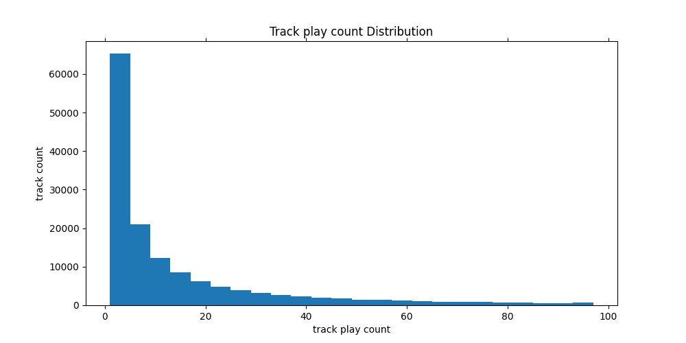

# Don't Stop the Music
## Abstract

In this project, we design and implement a song recommender system. To get the analysis data, we use Last.fm -1K from the Million Song Dataset. Last.fm -1k provides users' play history along with the user's and track's brief profile collected from Last.fm. We use collaborative filtering, which predicts user preferences in item selection based on the known user ratings. Specifically, we adopt KNN item-based model and latent factor model to make the recommendation, respectively, and the result shows that the implicit latent factor model works best. We think the rationale is that the data from Last.fm does not naturally contain the rating data, which exactly is what implicit latent factor helps. 

## Introduction
### Context
The recommender system has many successful applications in the industry. According to statistics, 40% of Amazon's sales are generated by the recommender system; 75% of Netflix users use the recommendation system to find their favorite videos; 30% of Netflix users use keywords to search the products they need before online shopping. Almost all news, search, advertising, short video applications are based on the recommender system nowadays.
### Object
Our study aims to make efficient offline music recommendations for users based on the Last.fm-1K dataset. This dataset contains a thousand users' play history and users' profiles.
### the Problem to Solve
In the original Last.fm dataset, we had more than eight million recordings, but many tracks only appeared once. To make the recommendation more efficient, we want to make sure how many songs should be used to apply to the training and prediction. For example, how many songs account for 80% of playing records? 

The second problem we are to solve is the 'rating' problem. We don't have an intuitive "rating" in our data; all we have is the play count of various songs. We use a straightforward solution to take the frequency of the track as the rating. The logic is that this will measure the strength of a song's "similarity" in the
Range [0,1].

As a comparison, we will try the other algorithm, namely Matrix Factorization-based Collaborative Filtering, which can directly use user-item interaction matrix as training data.
Matrix factorization can be used to discover latent features between two different kinds of entities. Converting our dataframe into a NumPy matrix in the format of the utility matrix is the problem to be solved. 


### Related Work
Since the recommender system is a quite mature project, there are many related works done by researchers and developers. McFee et al. introduced the Million Song Dataset Challenge in 2012[1]. Amazon uses its own algorithm, item-to-item collaborative filtering, in which online computation scales independently of the number of customers and number of items in the product catalog [2]. In [3], Elena Shakirova had an investigation of using collaborative filtering techniques for a music recommender system and found the best result for non-trivial α=0.15 and q=3 in the item-based case, α=0.3 and q=5 in the user-based case.


## Materials and Methods

### DataSet

Our datasets come from last.fm. There are two parts of the dataset, 

1. The Last.fm dataset in Million Song Dataset [4]

   http://millionsongdataset.com/lastfm/ , which provides songs metadata and song-level tags datasets.

   1) track_metadata.db

   Which contains 100k songs with track_id, title text, song_id , release time, artist_id , artist_mbid, artist_name, duration, artist_familiarit , artist_hotttnesss  year.

   2) lastfm_tags.db

   which provides a list of unique tags and a list of song-tag pairs. There are 50K unique tags, and each song can have multiple tags. Now, we can get song-level data used as an item dataset from the above two databases.

2. Last.fm Dataset-1k [5]

   http://ocelma.net/MusicRecommendationDataset/lastfm-1K.html, which provides users' play history  and users' brief profile collected from last.fm.  The play history contains almost 2000k lines with <index, user_id, timestamp, artist_id, artist_name, track_id, track_name> tuple, which has almost 1k users. The user profile data contains 1k users with <userid, gender, age, country, signup time>.


### Data Analysis

1. #### Data Trimming

   There are 2000k records in the Last.fm dataset, which contains many not valuable data. So the first step is to extract valuable data, intersection the play history and songs dataset, thus keeping the history that has responding songs in the songs dataset. After the intersect operation, the play history dataset is reduced to 800k lines, and the songs dataset is reduced to 20k lines.

   After data cleaning and extraction, we got a track metadata file, a play history data file, and a user profile data file. In this project, for now, we just used the play history data to build recommendation systems.
   <div  align = "center">
   
   </div>
   <div align = "center"> Fig.1 The original play history data </div>

   Since the dataset is too huge to fit our computer, the first step of the data analysis is extracting the play history of the most popular songs. We extract 20% of top popular songs’ history. The next step is aggregating the play count by group by (user id, track id). Then we got a data file as below: (user, track, play_count).
    <div  align = "center">
   
   </div>
   <div align = "center"> Fig.2 Trimmed dataset </div>
   

   The playing history dataset is an "implicit feedback" dataset, which reflects users’ behavior, but not explicitly provides the rating of various songs from users. We adopt a simple solution that is using fractional count as the rating. Fractional count in the range of [0,1], which can measure the strength of “likeness” for a song for a user [6].
   <div  align = "center">
   
   </div>
   <div align = "center"> Fig.3 Fractional count </div>
   
2. #### Data visualization

   Before we start the algorithm, we can have a look at the dataset distribution. For songs, we can statistic the top k most popular songs, artists, tags, countries, etc. For users, we can statistic the gender proportions and aged distribution. We can use the MatLab library to visualize those statistical results.
   
   
   
### Recommendation Algorithm

1. #### Item-based recommendation engine

   To implement item-based collaborative filtering, we need two kinds of data, users feature and items feature. We plan to extract song features and useful features from the song-tag dataset and user play history. When data is ready, we can build a song-user matrix. 

   We used PySpark to implement the item-based recommendation model. 

   ##### Building a utility matrix

   ```
   rdd = df.rdd.map(lambda x: (x.id_track, [(x.id_user, 1)]))
   rdd = rdd.reduceByKey(lambda a, b: a + b)
   rdd = rdd.map(lambda x: (x[0], SparseVector(1000, x[1])))
   matrix = spark.createDataFrame(rdd, ['id_track', 'features'])
   ```
   <div align = "center">
      
   </div>
   <div align = "center"> Fig.4 Build a matrix </div>

   If user1 has listened to song1 then unit[song1, user1] set as 1, otherwise set as 0, and the other options set unit[track1, user1] set as play count. Because the feature rows are long and sparse, so we use the sparse vector for it.

   ##### Computing similarity of songs

   Considering the scale of the dataset and evaluation metric, we used the function approxSimilarityJoin() in the pyspark to compute the similarity of all recommended songs with other songs for all test users in one go.
   <div align = "center">
      
    </div>
   <div align = "center"> Fig.5 Compute the similarity </div>

   ##### Computing the score for recommendation

   For each recommended song, we select k most similar songs to compute the score. The similarity score is calculated as
      


2. #### Matrix factorization-based collaborative filtering

   The users play history is a user behavior dataset, which doesn't explicitly reflect users' taste. Thus it's called implicit feedback. If we use the statistic method to construct user preferences directly, it will lose some information contained in play history. For implicit feedback, we use matrix factorization-based collaborative filtering to implement a recommendations system. The idea is to approximate the rating matrix R as the product of two rank k matrices:, where X is a k×U matrix and Y is a k×I matrix. The  hope is to be able to respectively summarize each user and  item  by  the k-dimensional  vectors and ,where the k components capture the salient latent factors  behind  the  ratings  matrix [7]. Apache Spark ML implements ALS for collaborative filtering, a viral algorithm for making recommendations. ALS recommender is a matrix factorization algorithm that uses Alternating Least Squares with Weighted-Lamda-Regularization (ALS-WR). The ALS algorithm should uncover the latent factors that explain the observed user to item ratings and tries to find optimal factor weights to minimize the least-squares between predicted and actual ratings. [8]. 
   ##### Train model
   
   Explicit model 
   
   Setting implicitPrefs =False, ratingCol="fractional_count" (using fractional_count replace explicit rating)
   
    ```
   ALS(maxIter=5, regParam=0.01, userCol="id_user", itemCol="id_track",
   					 ratingCol="fractional_count",
              implicitPrefs=False,
              coldStartStrategy="drop")
   model = als.fit(training)
    ```
   Implicit model 
   
   Setting implicitPrefs =Ture, ratingCol="count"
   
   ```
   ALS(maxIter=5, regParam=0.01, userCol="id_user", itemCol="id_track", ratingCol="count",
             implicitPrefs=True,
             coldStartStrategy="drop")
   ```
   
   
   
3. #### Evaluation Technology

   In our project, we implemented three different recommendation models, the item-based model, ALS(explicit) model, and ALS(implicit) model. Each model computes a score for each recommending item, we cannot directly compare the score, but we can compare the ranking performance. Mean Percentage Ranking (𝑀𝑃𝑅) is a good choice for us. In Collaborative Filtering for Implicit Feedback Datasets, which's author proposes using 𝑀𝑃𝑅 as an evaluation metric for Collaborative Filtering recommender systems[9]. Why do we use MPR, not RMSE or other metrics here? Since for implicit feedback, it is essential to realize that we don't have solid feedback on which items users don't like. There are many reasons for not listening. Thus, precision-based metrics, such as RMSE and MSE, are not very appropriate, as they require knowing which items users dislike for it to make sense[10]. To make these three feedbacks comparable，we use MPR as a global metric to evaluate the performances.

## Results

### Data visualization

   ·   We use pandas to plot the top 15 popular songs Top 15 popular songs
  <div align = "center">
   
  </div>
   <div align = "center"> Fig.6 Top 15 popular songs </div>
  

   ·   Distribution of play count of tracks 
   <div align = "center">
   
   </div>
   <div align = "center"> Fig.7 Distribution of play count of tracks  </div>
   
  ```
count  159913.000000
mean       51.889690
std       313.052664
min         1.000000
25%         2.000000
50%         7.000000
75%        26.000000
max     62913.000000
  ```

​		We can see that the median play count is 7. This provides us with some important information about how the number of times a song is played is distributed. We see that, on average, a song will be played more than 50 times, but in terms of median, 50% of the songs only play less than seven times. Therefore, in order to improve the processing efficiency and recommendation accuracy, we will only evaluate the songs with the top 20% play count.

### Evaluation
For comparing three models' performance, we created a test dataset, which contains 63 users and 2234  songs. Each user has played the part of the songs in the test dataset.

```
+-------+-------------+------------+
|id_user|played_song|not_played|
+-------+-------------+------------+
|    385|           78|        2156|
|     39|           61|        2173|
|    181|           81|        2153|
|    193|           73|        2161|
|    968|           35|        2199|
|    498|          162|        2072|
```

The models predict the scores for two thousand songs for each user, and compute the MPR.

Firstly, let's look at the comparison of the recommendation made by different models for individual users.

User no.39,  in the test dataset, has listened to 61 songs, and 2173 songs have never been played. 

In the top 20 recommendation, the item-based model hit one song on rank 18th, the ALS(explicit) model hit one song on rank 15th, and the ALS(implicit) model hits two songs on rank 9th and 10th. So, for user 39, ALS(implicit) made the best recommendation.
 <div align = "center">

  </div>

 <div align = "center">

   </div>
   
   <div align="center"> Fig.8 Comparsion of the result </div>

Then, we can compute the Mean Percentage Ranking (𝑀𝑃𝑅) by using all of the users' ranking lists.

```
+------------------+-------------------+
|       model      |                MPR|             
+------------------+-------------------+
|Item-based        |0.4187396245456742 |
+------------------+-------------------+
|ALS(explicit)     |0.4527974407436818 |
+------------------+-------------------+
|ALS(implicit)     |0.2591561751108617 |
+------------------+-------------------+
```

As mentioned in the context, to make these three feedbacks comparable， we use MPR as a global metric to evaluate the performances. The smaller MPR is, the better performance is. So from the above figure, we can see that ALS(implicit) model has the best performance. The second one is the item-based model, and the ALS(explicit) is the worst.

It's no surprise that ALS(implicit) model performs best because the dataset we used is an implicit feedback dataset, reflecting users' behavior. The ALS(implicit) algorithm algorithm can predict the probability of recommending items by digesting the implicit feedback in the dataset. The ALS(explicit) model, in this dataset, tries to predict fractional play count( is still play count) for recommending items, but we know that play counts are more uncertain compared to explicit rating. So ALS(explicit) model wants to predict the uncertain play counts precisely, which is a contradiction. For the item-based model, there is the same problem. The model can not sufficiently represent the implicit feedback dataset.


 ## Discussion

### Limitations 
Cold-start scenarios in recommender systems are situations in which no historical behavior, like ratings or clicks, is known for specific users or items[11]. It is common to encounter users and/or items in the test dataset that were not present during training the model. Spark allows users to set the coldStartStrategy parameter to "drop" in order to drop any rows in the DataFrame of predictions that contain NaN values. The evaluation metric will then be computed over the non-NaN data and will be valid[12]. While for item-based, there is no "official" way to avoid it. We did not take measures to deal with the cold start problem. This is a limitation of our result. Another limitation we want to address is the time spent on getting the similarity between items in the item-based approach beyond our expectations. To reduce the time consumed, we limit the test set size to 2,000 records when calculating the similarity. It will have an impact on the result without doubting. In the future, we wish to focus on optimization, thus applying the whole test set to the evaluation.
Sparseness is another fundamental problem that needs to be considered. In a real-world setting, the vast majority of songs are played very few times or even never be played at all by users. We are looking at a highly sparse matrix with more than 99% of entries are missing values. Grˇcar et al.[13] showed that item-based is dominant on datasets with relatively low sparsity, while latent factor approaches may perform better on highly sparse data. The latent factor model based on nonnegative matrix factorization is an effective way to solve the sparseness problem[14]. In order to be able to compare two songs, we use the SparseVector from Spark in the item-based approach. 

### Future Work
Currently, we only use the dataset Last.fm - 1K, which contains the play history. We would like to add more features like analysis of the users' taste combining with user profiles in future work. As we said in the limitations, we will continue to work on optimizing the item-based approach. Besides, we would like to explore variants of the latent factor models, especially for those that improve the performance of prediction or solve the weakness of the basic latent factor model.


   


##  Reference

[1] B.  McFee,  T.  Bertin-Mahieux,  D.  P.  W.  Ellis,  G.  R.  G.  Lanckriet,  The  million  song  datasetchallenge, in: Mille et al. [74], pp. 909–916.

[2] Linden, G., Smith, B. and York, J. (2003). Amazon.com Recommendations Item-to-Item Collaborative Filtering. [ebook] Available at:https://www.cs.umd.edu/~samir/498/Amazon-Recommendations.pdf[Accessed 10 Oct. 2017]

[3] E. Shakirova, "Collaborative filtering for music recommender system," 2017 IEEE Conference of Russian Young Researchers in Electrical and Electronic Engineering (EIConRus), St. Petersburg, 2017, pp. 548-550, doi: 10.1109/EIConRus.2017.7910613.

[4] Thierry Bertin-Mahieux, Daniel P.W. Ellis, Brian Whitman, and Paul Lamere, June 14, 2016, "Million Song Dataset", IEEE Dataport, doi: https://dx.doi.org/10.5072/FK27D2W31V.

[5] last.fm, https://www.last.fm/home


[6] Exl, Lukas, Johann Fischbacher, Alexander Kovacs, Harald Oezelt, Markus Gusenbauer, Kazuya Yokota, Tetsuya Shoji, Gino Hrkac, and Thomas Schrefl. "Magnetic microstructure machine learning analysis." *Journal of Physics: Materials* 2, no. 1 (2018): 014001. P447

[7] Emilien Dupont, Isabelle Rao, William Zhang, "CS229  Project  ReportOffline  Music  Recommendation"

[8] Alternating Least Squares (ALS) Spark ML, Elena Cuoco,  https://www.elenacuoco.com/2016/12/22/alternating-least-squares-als-spark-ml/?cn-reloaded=1

[9] ALS Matrix Factorization in Spark.ipynb https://colab.research.google.com/drive/1Ugrwtt9uab7PWnAKXuUrerUXuZqNk1no#scrollTo=MQX_vUJalKX9

[10] Yifan Hu, Yehuda Koren and Chris Volinsky, "Collaborative Filtering for Implicit Feedback Datasets" https://stackoverflow.com/questions/46462470/how-can-i-evaluate-the-implicit-feedback-als-algorithm-for-recommendations-in-ap

[11] D. Cao, X. Wu, Q. Zhou and Y. Hu, "Alleviating the New Item Cold-Start Problem by Combining Image Similarity," 2019 IEEE 9th International Conference on Electronics Information and Emergency Communication (ICEIEC), Beijing, China, 2019, pp. 589-595, doi: 10.1109/ICEIEC.2019.8784532.


[12] Spark, Collaborative Filtering, https://spark.apache.org/docs/2.2.0/ml-collaborative-filtering.html#collaborative-filtering-1

[13] Miha Grˇcar, Dunja Mladeniˇc, Blaˇz Fortuna, and Marko Grobelnik, "Data Sparsity Issues in the Collaborative Filtering Framework"

[14] W. Liu, B. Wang and D. Wang, "Improved Latent Factor Model in Movie Recommendation System," 2018 International Conference on Intelligent Autonomous Systems (ICoIAS), Singapore, 2018, pp. 101-104, doi: 10.1109/ICoIAS.2018.8494074.


